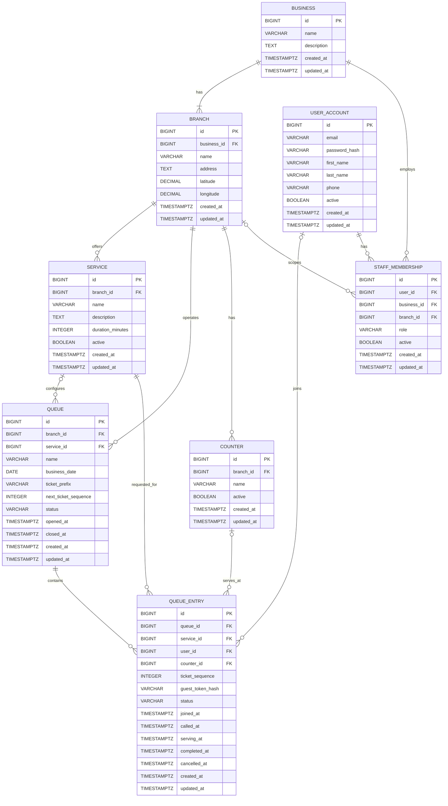

# QueueFlow ERD

## Phase 3 - Persistence & Domain Design

This ERD represents the revised QueueFlow persistence model for Phase 3.

A Queue represents one actual operational queue for a business day. Historical
closed queues remain available for operational history and future analytics.

This ERD must be reviewed by both developers before the complete Flyway
migration and JPA entity implementation is created.

## Domain Rules

### Daily operational queues

- A `Queue` represents one actual operating queue for a business day.
- A new Queue is created for a new operating day.
- `business_date` identifies the Queue's operating day.
- Queue status supports `OPEN`, `PAUSED`, and `CLOSED`.
- Closed queues stop being live/current but remain available as historical
  operational data.
- Queue records are not automatically deleted after 24 hours.

### Shared and service-specific queues

- Every Queue belongs to a Branch.
- `Queue.service_id` is nullable.
- A non-null `service_id` represents a service-specific Queue.
- A null `service_id` represents a shared branch Queue.
- `QueueEntry.service_id` records the actual Service requested by the customer,
  including when the customer participates in a shared Queue.

### Ticket numbering

- Each Queue has a `ticket_prefix`, such as `A`.
- Each QueueEntry stores a numeric `ticket_sequence`.
- A displayed ticket such as `A023` is derived from the Queue prefix and entry
  sequence.
- Ticket sequences restart for each new daily Queue.
- `UNIQUE(queue_id, ticket_sequence)` prevents duplicate ticket numbers within
  the same Queue.
- `next_ticket_sequence` must be updated safely under concurrent join requests.
- Cancelled or skipped ticket sequences are not reused.

### Queue entry lifecycle

QueueEntry status supports:

- `WAITING`
- `CALLED`
- `SERVING`
- `COMPLETED`
- `CANCELLED`
- `SKIPPED`

Queue position is calculated from active QueueEntries and ordering rather than
stored as a permanent position value.

### Guest participation

- `QueueEntry.user_id` is nullable.
- Customers do not need an account for basic queue participation.
- Guest ownership uses a secure guest-token mechanism.
- The database stores the secure token representation rather than relying on
  guest identity information.
- Guest name and phone are not required for the basic queue flow.

### Counters

- Counters are optional.
- `QueueEntry.counter_id` is nullable.
- A Queue and the Queue Board must operate without a Counter.
- Businesses using physical counters may associate an entry with a Counter
  during service.

### Staff membership

- StaffMembership associates a User with a Business.
- `StaffMembership.branch_id` is nullable.
- A null `branch_id` represents business-wide membership.
- A non-null `branch_id` represents branch-scoped membership.
- Roles can distinguish `STAFF`, `MANAGER`, and `OWNER`.

### Deferred domains

Appointment and Notification schemas are intentionally deferred.

They are planned for later roadmap phases and will be introduced through future
Flyway migrations once their domain requirements are finalized.

## Database Constraints

The persistence implementation should enforce at minimum:

- Foreign-key integrity between related entities.
- `UNIQUE(queue_id, ticket_sequence)` for QueueEntry.
- Required Queue operational fields such as `business_date`, `ticket_prefix`,
  `next_ticket_sequence`, `status`, and `opened_at`.
- Nullable relationships where the product explicitly supports optional
  behavior, including Queue.service_id, QueueEntry.user_id,
  QueueEntry.counter_id, and StaffMembership.branch_id.

Additional indexes and constraints will be finalized during persistence
implementation after ERD approval.

## Review Status

**Status:** Revised draft - awaiting developer re-review.

The complete PostgreSQL schema, Flyway migrations, JPA entities, repositories,
and persistence tests will be implemented after this revised ERD is approved.