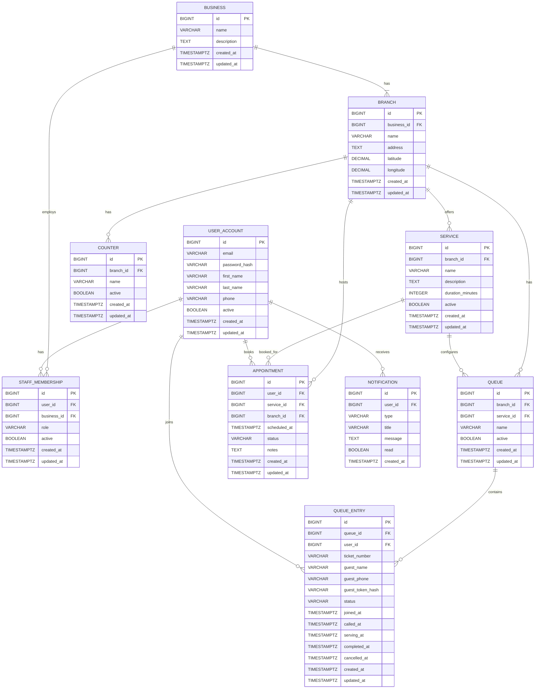

# QueueFlow ERD

## Phase 3 - Persistence & Domain Design

This ERD represents the proposed QueueFlow persistence model for Phase 3.

It must be reviewed by both developers before the complete Flyway migration
and JPA entity implementation is created.

## Domain Rules

- A business contains one or more branches.
- Services belong to individual branches.
- A queue always belongs to a branch.
- A queue may optionally belong to a service, allowing both shared and
  service-specific queues.
- Customers can participate in queues without creating an account.
- `QueueEntry.user_id` is therefore nullable for guest entries.
- Guest queue entries use a secure guest token mechanism so a guest can
  access or cancel only their own ticket.
- Queue position is calculated from active queue entries rather than stored
  permanently.
- Queue entry states include `WAITING`, `CALLED`, `SERVING`, `COMPLETED`,
  `CANCELLED`, and `SKIPPED`.
- Ticket numbers are sequential within their queue/session and must be
  generated safely under concurrent requests.
- Counters are optional and must not be required for queue operation.
- Staff permissions are represented through business memberships and roles.
- Notification participation is optional.

## Review Status

**Status:** Draft - awaiting developer review.

The ERD must be reviewed before the complete PostgreSQL schema, Flyway
migrations, JPA entities, repositories, and persistence tests are implemented.